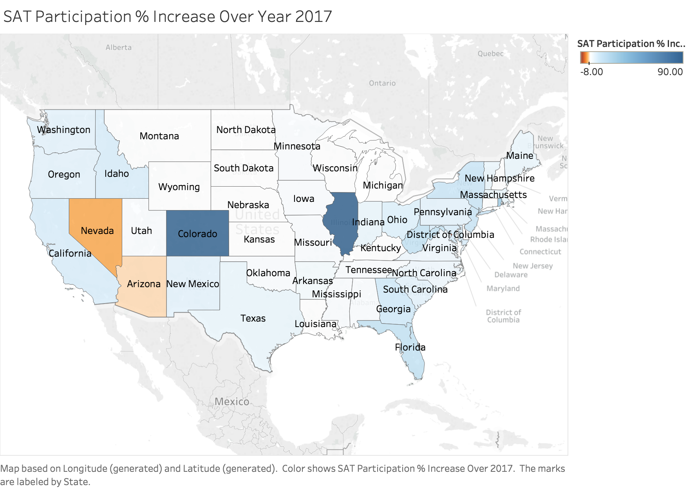
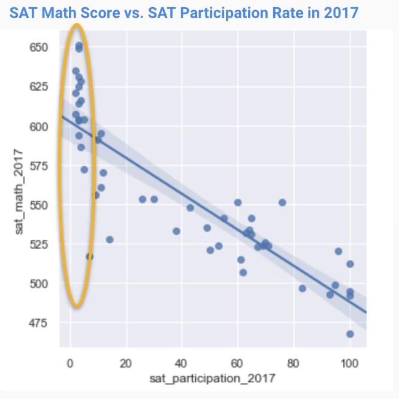
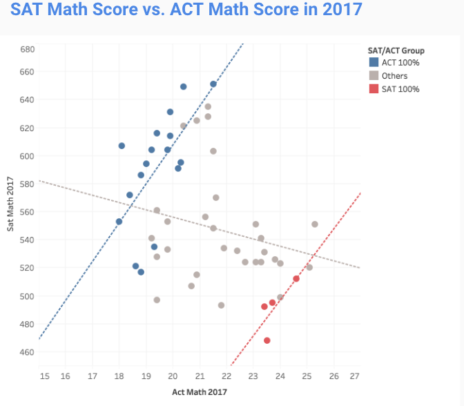

#  Project 1: A glance at SAT/ACT participation rates

[Click here for the full jupyter notebook](code/project_1_sat_act_eda.ipynb)

## Problem Statement

The new format for the SAT was released in March 2016. We track statewide participation and scores and aim to find influencing factors and draw actionable insights to strategize investment to increase SAT participation rates.

---

## Executive Summary

To be furnished.

We will discuss the details of the observations made from this exploratory data analysis in the conclucion section.

---

## Data Analyzed

- ACT data

|Feature|Type|Dataset|Description|
|---|---|---|---|
|**act_state**|*string*|act_2017_new & act_2018_new|Name of the state in the United States| 
|**act_participation**|*float*|act_2017_new & act_2018_new|The percent of students taking ACT in the state (units percent to one decimal place)|
|**act_english**|*float*|act_2017_new & act_2018_new|The average score of English subject for students in this state|
|**act_math**|*float*|act_2017_new & act_2018_new|The average score of Math subject for students in this state|
|**act_reading**|*float*|act_2017_new & act_2018_new|The average score of Reading subject for students in this state|
|**act_science**|*float*|act_2017_new & act_2018_new|The average score of Science subject for students in this state|
|**act_composite**|*float*|act_2017_new & act_2018_new|The average score of Composite subject for students in this state|

- SAT data

|Feature|Type|Dataset|Description|
|---|---|---|---|
|**sat_state**|*string*|sat_2017_new & act_2018_new|Name of the state in the United States| 
|**sat_participation**|*float*|sat_2017_new & act_2018_new|The percent of students taking SAT in the state (units percent to one decimal place)|
|**sat_ebrw**|*float*|sat_2017_new & act_2018_new|The average score of English subject for students in this state|
|**sat_math**|*float*|sat_2017_new & act_2018_new|The average score of Math subject for students in this state|
|**sat_total**|*float*|sat_2017_new & act_2018_new|The average score of Reading subject for students in this state|

---

## Conclusion

In 2018, SAT participation rates see stable improvement in majority of the states, likely due to the SAT School Day program and state mandate of the test to fulfill state accountability, although SAT/ACT disparity still remains between the coastal/midwest region.

The map below shows that SAT participation saw increase in majority of the states.

In the scatter plot below, the states with low (<10%) SAT participation rates had much higher SAT scores (in top 50th percentile) than the rest. This is likely due to self-select bias. In the midwest, where ACT dominates, usually only the students who are applying for private universities take SAT. They took the test to boost their portfolio, so it is natural that they’d only take the test as they believe they will do well. 

The plot below explores the relationship between SAT and ACT score. We see that for states with either SAT/ACT as the standardized test to fulfill state accountability, there seems a better fit of the linear regression. This suggests that SAT and ACT are aligned to certain level in testing students’ readiness for college.

For states with SAT/ACT as a voluntary option however, the data points are quite dispersed and there is no clear correlation between the SAT and ACT scores. We can’t attribute this ‘randomness’ to the inconsistency between the two test formats, as the testing populations vary from state to state.

*Caveat*: We see increase in most of the subject scores. But the comparison of year-over-year results is not within the scope of this analysis as SAT revised the test format in 2016 and the population is still on the way getting accustomized to the content.* 

---

## Recommendation

**States with organically higher SAT participation rates**

*States: California, District of Columbia, Georgia, Hawaii, Indiana, Maryland, Massachusetts, New Jersey, New York, Pennsylvania, Texas, Vermont, Virginia, Washington*

There is great demand for SAT in these states to get into the schools where SAT has historically been a requirement. 

Possible approach: 

Continue to promote SAT School Day program or increase SAT test centres when there is a growing demand.

**States with ACT mandate**

*States: Alabama, Arkansas, Kentucky,Louisiana,Minnesota,Mississippi,Missouri,Montana,Nebraska,Nevada,North Carolina,North Dakota,Ohio,Oklahoma,South Carolina,Tennessee,Utah,Wisconsin,Wyoming*
    
It could be more difficult to push SAT in these states as policies have been rolled out. 

Possible approach: 

In the short term, target at schools with students likely to apply for private universities with promotion programs (e.g. SAT School Day, free SAT). 

In the long run, coorporate with the state government to raise awareness of SAT and to push SAT for choice of state-level contract

**States without ACT mandate yet having low SAT participation rates**

*States: Alaska, Arizona, Iowa, Kansas, New Mexico, Oregon, South Dakota, West Virginia*

Possible approach: 

It probably requires more work to firstly persuade the government to reinstate the importance of tertiary education and make college admission test compulsory as state accountability. Following suit, actions could be taken to increase the SAT participation rates similar to the above. 

