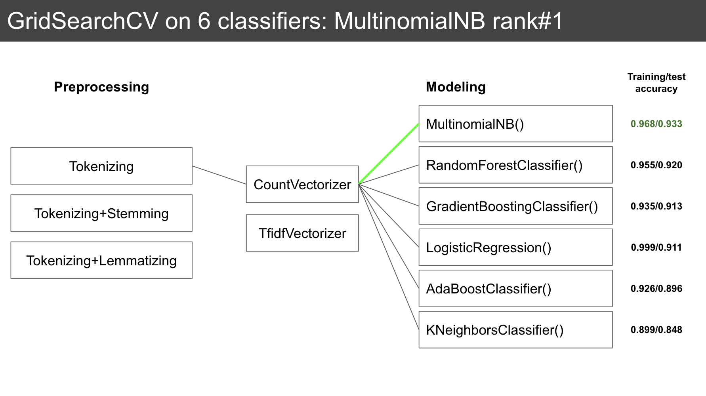
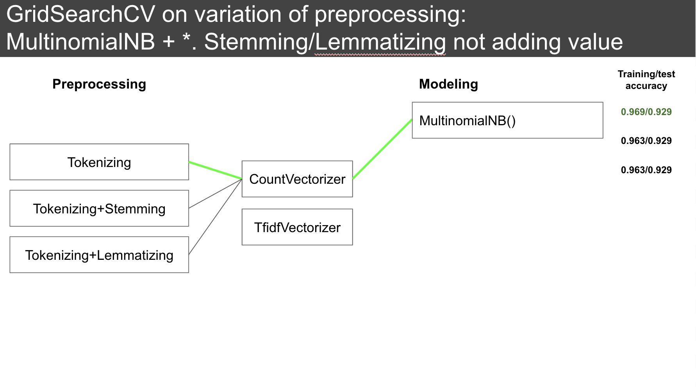
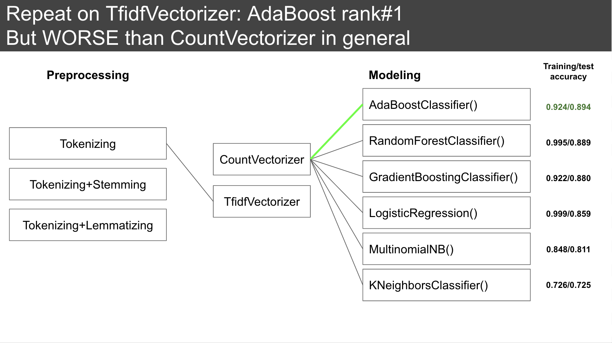

#  Project 3: Web APIs & Classification

### Problem Statement

Use NLP to train a classifier to tell which of the two selected subreddits a given post should come from.

#### Executive Summary

As a diehard fan of Harry Potter series, the characters and the events in the books/movies are stored in my brain in chronological order. I could easily tell which era / which title of the book the stories belong to. However it might not be so easy for a casual fan of the Harry Potter film series or its spinoff, Fantastic Beasts and Where to Find Them. Also, it is natural to find a lot in common between the two series as there are a couple of characters that appear in both series, and of course topics could be a mix of the two since the author/film crew are (almost) the same. Therefore it would be quite normal to see posts wrongly created in the other subreddit.

This project aims to propose a classification model that would be able to help aggregate the posts more accurately based on the title and the body text of the post. To achieve this, I selected and evaluated a few classification models using Natural Language Processing (NLP) tools.

The subreddits chosen to compare are:

- [**r/harrypotter**](https://www.reddit.com/r/harrypotter/)
- [**r/FantasticBeasts**](https://www.reddit.com/r/FantasticBeasts/)

---

### Data Science Process

**1. Data Collection using PushshiftAPI**

[Python Pushshift.io API Wrapper](https://github.com/dmarx/psaw) is extremely helpful for submission search. The data used to train the model is gathered using psaw (the wrapper). With a limit of the latest 5000 submissions, in total 2885 posts from harrypotter subreddit and 1221 posts from fantasticbeasts were extracted.

**2. Preprocessing**

Tokenizing, stemming and lemmatizing were implemented; the output from each of these techniques were stored. The dataset was then split into Training and Test set.

**3. Modeling**

GridSearchCV was used to explore the best combination of vectorizer and classifier. 

Tested vectorizing methods include:
- Count Vectorizer
- TF-IDF (Term Frequency-Inverse Document Frequency) 

Tested classifiers include:
- Multinomial Naive Bayes
- K-Nearest-Neighbors
- Logistic Regression
- Random Forest
- AdaBoost
- Gradient Boosting

Steps taken to identify the best combination are illustrated in the images below:

---

### Data Dictionary

The following variables were used:

|Feature|Type|Dataset|Description|
|---|---|---|---|
|**all_text**|*string*|X_train,X_test|A concatenated string of post title and the body text|
|**post**|*string*|X_train,X_test|Variable **all_text**, with tokenizing using basic regular expression to extract words| 
|**post_st**|*string*|X_train,X_test|Variable **post** with stemming|
|**post_lm**|*string*|X_train,X_test|Variable **post** with lemmatizing|
|**is_hp**|*integer*|y_train,y_test|Target variable, 1 represents Harry Potter subreddit and 0 for Fantastic Beasts

---

### Conclusion 

With a few iterations, the model that we found most accurate is the MultinomialNB on CountVectorizer with basic tokenizing (no stemming or lemmatizing).

Multinomial Naive-Bayes Train/Test Accuracy score: 96.9%/93.0%

---

### Takeaway from the modeling process

There is no 'best' solution that fits all problems. In this case, Lemmatizing and Stemming doesn't help further improve the model, possibly because the coined words (character names) unique to the novels are what differentiate the two classes, so as long as they are preserved the models perform reasonably well. 

Logistic Regression and Random Forest seem extremely capable in fitting the training data (~100% accuracy score), but had a higher tendency to overfit than other models.

---

### Next steps

Use ensemble modeling - sklearn’s VotingClassifier to improve accuracy

Collect new posts from the subreddits to further evaluate and optimize the model
